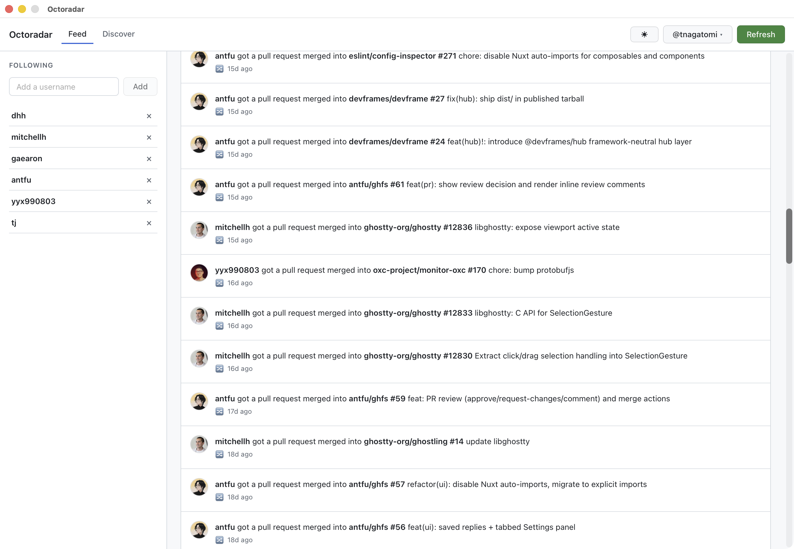
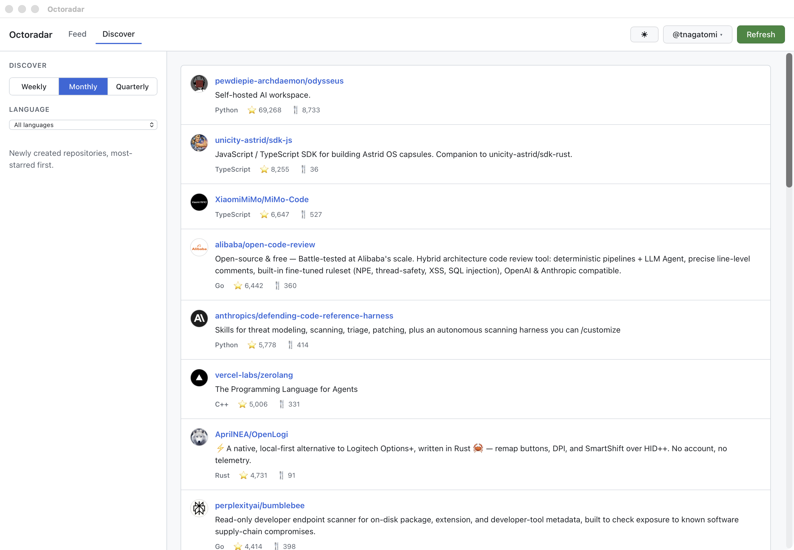

# Octoradar

A small desktop app for keeping an eye on GitHub. Follow a set of users to get a unified feed of their public activity and merged pull requests, and browse trending repositories from the Discover tab.

Octoradar is built with [Wails](https://wails.io/) (Go + React). It signs in through GitHub's OAuth device flow and stores your access token in the OS keychain — never in plain text on disk.

## Screenshots

| Feed | Discover |
| --- | --- |
| [](docs/images/feed.png) | [](docs/images/discover.png) |

## Install

Download the latest build for your platform from the [Releases page](https://github.com/tnagatomi/octoradar/releases).

### macOS

The `.dmg` ships a universal build for both Apple Silicon and Intel.

1. Open the `.dmg` and drag **Octoradar** into **Applications**.
2. The app is ad-hoc signed but not notarized, so the first launch is blocked by Gatekeeper. Double-click **Octoradar** once (it will be blocked), then open **System Settings → Privacy & Security**, scroll down, and click **Open Anyway** next to the Octoradar message. You only need to do this once.

   Alternatively, clear the quarantine flag from a terminal:

   ```sh
   xattr -dr com.apple.quarantine /Applications/Octoradar.app
   ```

### Linux

Pick the package for your distribution (replace `<version>` accordingly):

```sh
# Debian / Ubuntu
sudo apt install ./octoradar_<version>_amd64.deb

# Fedora / RHEL / openSUSE
sudo dnf install ./octoradar-<version>-1.x86_64.rpm
```

The packages declare their runtime dependencies (GTK 3 and WebKit2GTK 4.1). The GitHub token is stored through the Secret Service API, so a keyring daemon such as `gnome-keyring` must be running.

A plain `.tar.gz` is also provided for other distributions; extract it and run the `octoradar` binary, providing WebKit2GTK and a keyring daemon yourself.

## Usage

1. Launch Octoradar and sign in: it shows a one-time code to enter at the GitHub URL it opens in your browser.
2. Add the GitHub usernames you want to follow.
3. Watch the **Feed** for their activity, or switch to **Discover** for trending repositories.

## Build from source

Prerequisites: Go (see `go.mod` for the version), Node.js 22 with [pnpm](https://pnpm.io/), and the [Wails CLI](https://wails.io/docs/gettingstarted/installation).

Octoradar needs a GitHub OAuth app **client ID** (with device flow enabled). The device-flow client ID is not a secret. Provide it via the `OCTORADAR_CLIENT_ID` environment variable for development, or bake it into a build with `-ldflags`:

```sh
# Live development
OCTORADAR_CLIENT_ID=<client-id> wails dev

# Production build
wails build -ldflags "-X github.com/tnagatomi/octoradar/internal/oauth.BuildClientID=<client-id>"
```

## License

[MIT](LICENSE)
